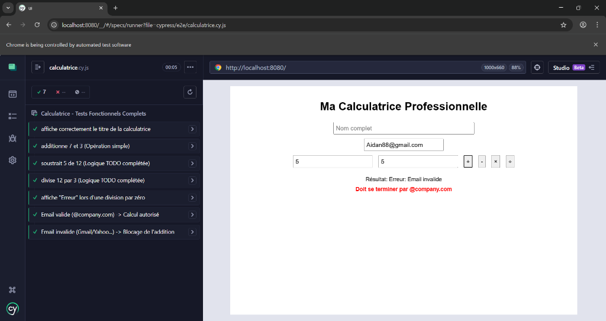

# TP4 Cypress - Configuration and Functional Testing

[](https://www.cypress.io/)
[](https://fakerjs.dev/)

## 📋 Description

Projet de TP4 consacré aux tests fonctionnels avec Cypress. Ce projet implémente une calculatrice professionnelle avec validation d'email corporate et une suite complète de tests end-to-end (E2E).

## 🎯 Objectifs

- Créer une application web fonctionnelle avec HTML/CSS/JavaScript
- Configurer un environnement de test Cypress
- Implémenter des tests E2E couvrant les cas nominaux et limites
- Utiliser Faker pour générer des données de test réalistes
- Valider des règles métier (validation email @company.com)

## 🏗️ Structure du Projet

```
TP4_Cypress/
├── ui/
│   ├── index.html              # Interface utilisateur
│   ├── app.js                  # Logique JavaScript
│   ├── cypress.config.js       # Configuration Cypress
│   ├── package.json            # Dépendances npm
│   └── cypress/
│       └── e2e/
│           └── calculatrice.cy.js  # Suite de tests
├── Rapport/
│   ├── CR_BOUANANI_TP4_Cypress.tex  # Source LaTeX
│   ├── CR_BOUANANI_TP4_Cypress.pdf  # Rapport PDF
│   └── figures/                     # Images et captures
└── .gitignore
```

## 🚀 Installation

### Prérequis

- Node.js (v14 ou supérieur)
- npm

### Étapes d'installation

1. Cloner le dépôt :
```bash
git clone https://github.com/abderrahmanBouanani/Cypress---Configuration-and-Functional-Testing.git
cd Cypress---Configuration-and-Functional-Testing
```

2. Installer les dépendances :
```bash
cd ui
npm install
```

3. Installer http-server (si non installé) :
```bash
npm install -g http-server
```

## 💻 Utilisation

### Lancer l'application

1. Démarrer le serveur web :
```bash
cd ui
http-server -p 8080
```

2. Ouvrir le navigateur à l'adresse : `http://localhost:8080`

### Exécuter les tests Cypress

**Mode interactif :**
```bash
cd ui
npx cypress open
```

**Mode headless :**
```bash
cd ui
npx cypress run
```

## ✨ Fonctionnalités

### Application Calculatrice

- **Opérations mathématiques** : Addition, Soustraction, Multiplication, Division
- **Validation email** : Seuls les emails @company.com sont autorisés pour l'addition
- **Gestion d'erreurs** : Division par zéro gérée correctement
- **Interface responsive** : Design simple et intuitif

### Suite de Tests (7 tests)

1. ✅ Vérification de l'interface
2. ✅ Test d'addition (7 + 3 = 10)
3. ✅ Test de soustraction (12 - 5 = 7)
4. ✅ Test de division (12 ÷ 3 = 4)
5. ✅ Test de division par zéro
6. ✅ Test avec email valide (@company.com)
7. ✅ Test avec email invalide (blocage de l'addition)

## 🛠️ Technologies Utilisées

- **Frontend** : HTML5, CSS3, JavaScript (Vanilla)
- **Tests** : Cypress v15.9.0
- **Génération de données** : @faker-js/faker v9.9.0
- **Serveur web** : http-server
- **Documentation** : LaTeX

## 📊 Résultats des Tests

Tous les 7 tests passent avec succès :



## 📄 Documentation

Le rapport complet du TP est disponible dans le dossier `Rapport/` :
- **Source LaTeX** : `CR_BOUANANI_TP4_Cypress.tex`
- **PDF** : `CR_BOUANANI_TP4_Cypress.pdf`

## 👨‍💻 Auteur

**BOUANANI Abderrahman**  
Développement Logiciel et Applicatif (DLA) - 2ème Année  
École Nationale des Sciences Appliquées d'Agadir

## 📝 Licence

Ce projet est réalisé dans le cadre d'un TP académique.

## 🙏 Remerciements

- Prof. Aimad QAZDAR pour l'encadrement
- ENSAA pour la formation
